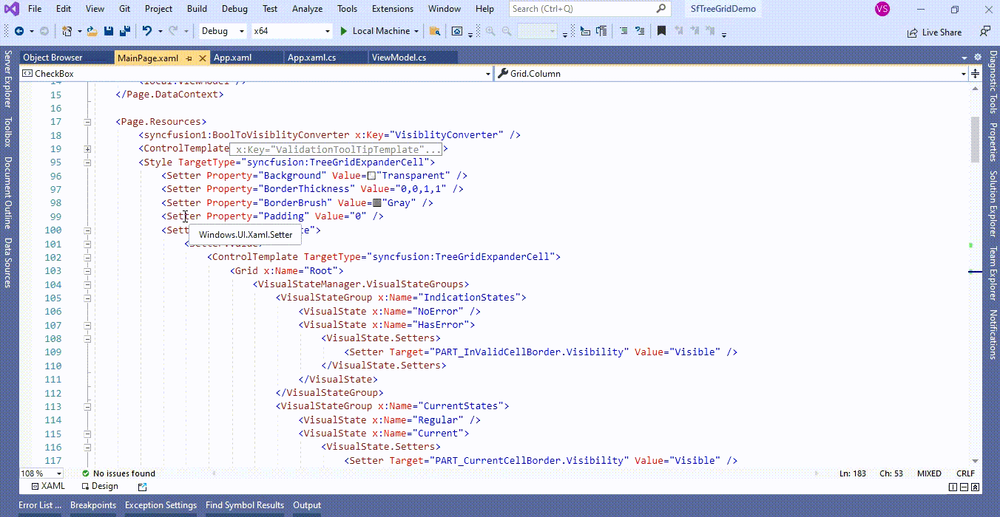
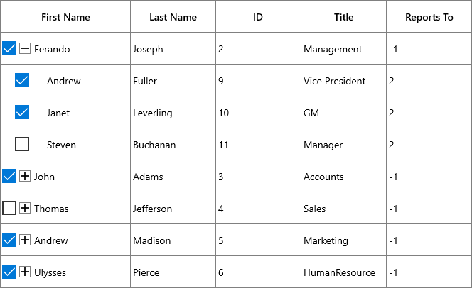

# How to modify Expander cell node checkbox position in UWP TreeGrid (SfTreeGrid)?

## About the sample
This example illustrates how to modify Expander cell node checkbox position in [UWP TreeGrid](https://www.syncfusion.com/uwp-ui-controls/treegrid) (SfTreeGrid)?

[UWP TreeGrid](https://www.syncfusion.com/uwp-ui-controls/treegrid) (SfTreeGrid) does not provide the direct support to change the position of Node CheckBox in [TreeGridExpanderCell](https://help.syncfusion.com/cr/uwp/Syncfusion.UI.Xaml.TreeGrid.TreeGridExpanderCell.html). You can change the position of Node CheckBox by overriding the [TreeGridExpanderCell](https://help.syncfusion.com/cr/uwp/Syncfusion.UI.Xaml.TreeGrid.TreeGridExpanderCell.html) Template in [UWP TreeGrid](https://www.syncfusion.com/uwp-ui-controls/treegrid) (SfTreeGrid).

```XML
<Page.Resources>
        <syncfusion1:BoolToVisiblityConverter x:Key="VisiblityConverter" />
        <ControlTemplate x:Key="ValidationToolTipTemplate">
            <Grid x:Name="PART_ToolTipPresenter"
              Margin="5,0"
              Opacity="0"
              RenderTransformOrigin="0,0">
                <Grid.RenderTransform>
                    <TranslateTransform x:Name="Transform" X="-25" />
                </Grid.RenderTransform>
                <VisualStateManager.VisualStateGroups>
                    <VisualStateGroup x:Name="OpenStates">
                        <VisualStateGroup.Transitions>
                            <VisualTransition GeneratedDuration="0" />
                            <VisualTransition GeneratedDuration="0:0:0.2" To="Opened">
                                <Storyboard>
                                    <DoubleAnimation Duration="0:0:0.2"
                                                 Storyboard.TargetName="Transform"
                                                 Storyboard.TargetProperty="X"
                                                 To="0">
                                        <DoubleAnimation.EasingFunction>
                                            <BackEase Amplitude=".3" EasingMode="EaseOut" />
                                        </DoubleAnimation.EasingFunction>
                                    </DoubleAnimation>
                                    <DoubleAnimation Duration="0:0:0.2"
                                                 Storyboard.TargetName="PART_ToolTipPresenter"
                                                 Storyboard.TargetProperty="Opacity"
                                                 To="1" />
                                </Storyboard>
                            </VisualTransition>
                        </VisualStateGroup.Transitions>
                        <VisualState x:Name="Closed">
                            <Storyboard>
                                <DoubleAnimation Duration="0"
                                             Storyboard.TargetName="PART_ToolTipPresenter"
                                             Storyboard.TargetProperty="Opacity"
                                             To="0" />
                            </Storyboard>
                        </VisualState>
                        <VisualState x:Name="Opened">
                            <Storyboard>
                                <DoubleAnimation Duration="0"
                                             Storyboard.TargetName="Transform"
                                             Storyboard.TargetProperty="X"
                                             To="0" />
                                <DoubleAnimation Duration="0"
                                             Storyboard.TargetName="PART_ToolTipPresenter"
                                             Storyboard.TargetProperty="Opacity"
                                             To="1" />
                            </Storyboard>
                        </VisualState>
                    </VisualStateGroup>
                </VisualStateManager.VisualStateGroups>

                <Border Margin="4,4,-4,-4"
                    Background="#052A2E31"
                    CornerRadius="5" />
                <Border Margin="3,3,-3,-3"
                    Background="#152A2E31"
                    CornerRadius="4" />
                <Border Margin="2,2,-2,-2"
                    Background="#252A2E31"
                    CornerRadius="3" />
                <Border Margin="1,1,-1,-1"
                    Background="#352A2E31"
                    CornerRadius="2" />

                <Border Background="#FFDC000C" CornerRadius="2" />
                <Border CornerRadius="2">
                    <TextBlock MaxWidth="250"
                           Margin="8,4,8,4"
                           Foreground="White"
                           Text="{TemplateBinding Tag}"
                           TextWrapping="Wrap"
                           UseLayoutRounding="false" />
                </Border>
            </Grid>
        </ControlTemplate>

        <Style TargetType="syncfusion:TreeGridExpanderCell">
            <Setter Property="Background" Value="Transparent" />
            <Setter Property="BorderThickness" Value="0,0,1,1" />
            <Setter Property="BorderBrush" Value="Gray" />
            <Setter Property="Padding" Value="0" />
            <Setter Property="Template">
                <Setter.Value>
                    <ControlTemplate TargetType="syncfusion:TreeGridExpanderCell">
                        <Grid x:Name="Root">
                            <VisualStateManager.VisualStateGroups>
                                <VisualStateGroup x:Name="IndicationStates">
                                    <VisualState x:Name="NoError" />
                                    <VisualState x:Name="HasError">
                                        <VisualState.Setters>
                                            <Setter Target="PART_InValidCellBorder.Visibility" Value="Visible" />
                                        </VisualState.Setters>
                                    </VisualState>
                                </VisualStateGroup>
                                <VisualStateGroup x:Name="CurrentStates">
                                    <VisualState x:Name="Regular" />
                                    <VisualState x:Name="Current">
                                        <VisualState.Setters>
                                            <Setter Target="PART_CurrentCellBorder.Visibility" Value="Visible" />
                                        </VisualState.Setters>
                                    </VisualState>
                                </VisualStateGroup>
                                <VisualStateGroup x:Name="FooterStates">
                                    <VisualState x:Name="NormalCell" />
                                    <VisualState x:Name="FrozenColumnCell"/>
                                    <VisualState x:Name="FooterColumnCell">
                                        <Storyboard BeginTime="0">
                                            <ObjectAnimationUsingKeyFrames BeginTime="0"
                                                                       Duration="1"
                                                                       Storyboard.TargetName="PART_FooterCellBorder"
                                                                       Storyboard.TargetProperty="BorderThickness">
                                                <DiscreteObjectKeyFrame KeyTime="0" Value="1,0,1,1" />
                                            </ObjectAnimationUsingKeyFrames>
                                        </Storyboard>
                                    </VisualState>
                                    <VisualState x:Name="BeforeFooterColumnCell">
                                        <Storyboard BeginTime="0">
                                            <ObjectAnimationUsingKeyFrames BeginTime="0"
                                                                       Duration="1"
                                                                       Storyboard.TargetName="PART_FooterCellBorder"
                                                                       Storyboard.TargetProperty="BorderThickness">
                                                <DiscreteObjectKeyFrame KeyTime="0" Value="0,0,0,1" />
                                            </ObjectAnimationUsingKeyFrames>
                                            <ObjectAnimationUsingKeyFrames BeginTime="0"
                                                                       Duration="1"
                                                                       Storyboard.TargetName="PART_GridCellBorder"
                                                                       Storyboard.TargetProperty="BorderThickness">
                                                <DiscreteObjectKeyFrame KeyTime="0" Value="0,0,0,1" />
                                            </ObjectAnimationUsingKeyFrames>
                                        </Storyboard>
                                    </VisualState>
                                </VisualStateGroup>
                            </VisualStateManager.VisualStateGroups>
                            <Border x:Name="PART_FooterCellBorder"
                                Background="{TemplateBinding Background}"
                                BorderBrush="{TemplateBinding BorderBrush}" 
                                BorderThickness="{TemplateBinding BorderThickness}"/>
                            <Border x:Name="PART_GridCellBorder"
	                                Background="{TemplateBinding Background}"
	                                BorderBrush="{TemplateBinding BorderBrush}"
	                                BorderThickness="{TemplateBinding BorderThickness}">
                                <Grid Margin="{TemplateBinding IndentMargin}">
                                    <Grid.ColumnDefinitions>
                                        <ColumnDefinition Width="Auto" />
                                        <ColumnDefinition Width="18" />
                                        <ColumnDefinition Width="*" />
                                    </Grid.ColumnDefinitions>
                                    <syncfusion:TreeGridExpander x:Name="PART_ExpanderCell"
                                                    Grid.Column="1"
                                                    Width="16"
                                                    Height="16"
                                                    Margin="2,1,0,1"
                                                    HorizontalAlignment="Center"
                                                    VerticalAlignment="Center"
                                                    IsExpanded="{Binding RelativeSource={RelativeSource TemplatedParent},
                                                                         Path=IsExpanded,
                                                                         Mode=TwoWay,
                                                                         UpdateSourceTrigger=PropertyChanged}"
                                                    Visibility="{Binding RelativeSource={RelativeSource TemplatedParent},
                                                                         Path=HasChildNodes,
                                                                         Converter={StaticResource VisiblityConverter},
                                                                         Mode=TwoWay}" />

                                    <CheckBox Name="PART_SelectCheckBox"
                                      Grid.Column="0"
                                      Width="16"
                                      Height="16"
                                      MinWidth="22"
                                      Margin="2,0,0,0"
                                      HorizontalAlignment="Center"
                                      VerticalAlignment="Center"
                                      IsEnabled="{Binding RelativeSource={RelativeSource TemplatedParent},
                                                          Path=IsCheckBoxEnabled,
                                                          Mode=TwoWay,
                                                          UpdateSourceTrigger=PropertyChanged}"
                                      IsTabStop="False"
                                      IsThreeState="True"
                                      Visibility="{Binding Path=ColumnBase.Renderer.TreeGrid.ShowCheckBox,
                                                           RelativeSource={RelativeSource Mode=TemplatedParent},
                                                           Converter={StaticResource VisiblityConverter},
                                                           Mode=TwoWay}" />


                                    <Grid Grid.Column="2"
                                  Margin="2,0,0,0">
                                        <ContentPresenter />
                                        <Border x:Name="PART_CurrentCellBorder"
                                        Margin="1,0,0,0"
                                        Background="Transparent"
                                        BorderBrush="{TemplateBinding CurrentCellBorderBrush}"
                                        BorderThickness="{TemplateBinding CurrentCellBorderThickness}"
                                        IsHitTestVisible="False"
                                        Visibility="Collapsed" />
                                        <Border x:Name="PART_InValidCellBorder"
                                        Width="10"
                                        Height="10"
                                        HorizontalAlignment="Right"
                                        VerticalAlignment="Top"
                                        Visibility="Collapsed">
                                            <ToolTipService.ToolTip>

                                                <ToolTip Background="#FFDB000C"
                                                 Placement="Right"
                                                 Tag="{TemplateBinding ErrorMessage}"
                                                 Template="{StaticResource ValidationToolTipTemplate}" />

                                            </ToolTipService.ToolTip>
                                            <Path Data="M0.5,0.5 L12.652698,0.5 12.652698,12.068006 z"
                                          Fill="Red"
                                          Stretch="Fill" />
                                        </Border>
                                    </Grid>
                                </Grid>
                            </Border>
                        </Grid>
                    </ControlTemplate>
                </Setter.Value>
            </Setter>
        </Style>
</Page.Resources>

```


The following screenshot shows the position of Node checkbox changed in [UWP TreeGrid](https://www.syncfusion.com/uwp-ui-controls/treegrid) (SfTreeGrid),



Take a moment to peruse the [UWP TreeGrid - Node CheckBox](https://help.syncfusion.com/wpf/treegrid/node-checkbox) documentation, where you can find about Node CheckBox with code examples.

Please refer this [link](https://www.syncfusion.com/uwp-ui-controls/treegrid) to know about the essential features of UWP TreeGrid.

## Requirements to run the demo
Visual Studio 2015 and above versions
